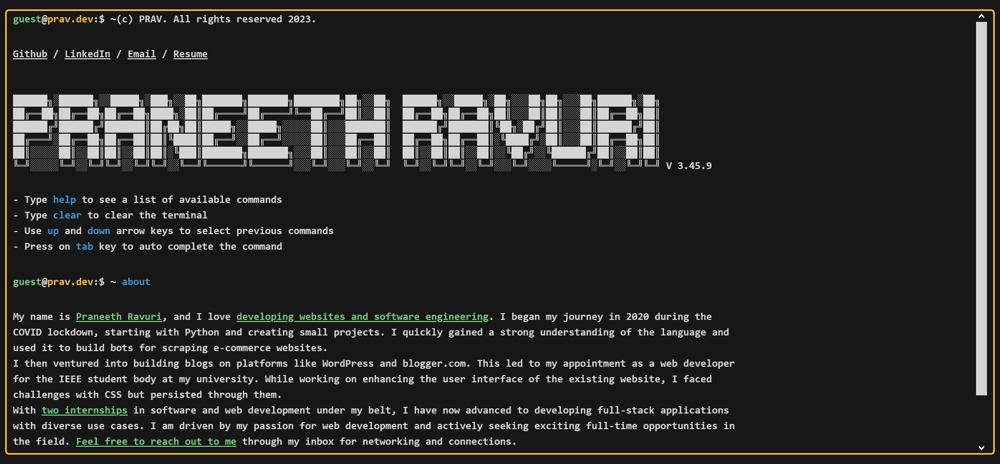

<p align="center">
<a href="https://prav.dev/" target="_blank">

</a>
</p>

# Prav Terminal - Portfolio Website


</p>

<p align="center">
  <a href="https://app.netlify.com/sites/reliable-druid-a6a637/deploys">
    
  </a>
</p>

<h3 align="center">


</h3>

### [https://praneethravuri.com/](https://praneethravuri.com/)

Inspired By - [Yassine Fathi](https://term.m4tt72.com/)

## Project setup
```
npm install
```

### Compiles and hot-reloads for development
```
npm run dev
```

### Compiles and minifies for production
```
npm run build
```

### Lints and fixes files
```
npm run lint
```

### Customize configuration
See [Configuration Reference](https://cli.vuejs.org/config/).

## Color Reference

| Color          | Hex                                                                |
| -------------- | ------------------------------------------------------------------ |
| Lime Green     |  `#39FF14` |
| White          |  `#F7F7F7` |
| Bright Blue    |  `#00a6f4` |
| Bright Purple  |  `#BF40BF` |
| Black          |  `#151515` |
| Orange         |  `#FC7300` |
| Yellow         |  `#FFDE00` |
| Off-White      |  `#F8F1F1` |
| Teal           |  `#125B50` |
| Electric Green |  `#BFDB38` |
| Pink-Red       |  `#FF4057` |
| Brown          |  `#B3541E` |
| Pink           |  `#F535AA` |
| Turquoise Blue |  `#00f5d0` |


## Fonts

1. Source Code Pro
